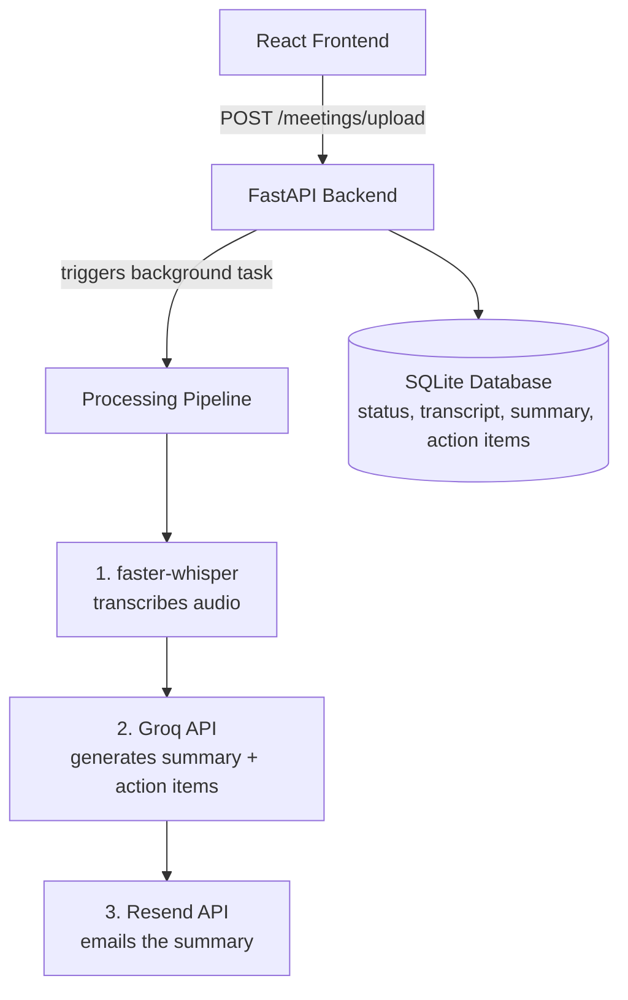

# 🧠 MeetMind

**AI-powered meeting assistant** that transcribes recordings, generates summaries and action items, and emails them automatically — no manual note-taking required.

🔗 **Live Demo:** [meetmind-frontend-e5lm.onrender.com](https://meetmind-frontend-e5lm.onrender.com)

---

## ✨ Features

- 🎙️ **Upload any recording** — audio or video (mp3, wav, mp4, etc.)
- 📝 **Automatic transcription** powered by [faster-whisper](https://github.com/SYSTRAN/faster-whisper), running locally at zero API cost
- 🤖 **AI summarization** via [Groq](https://groq.com) — concise summary + extracted action items
- 📧 **Automated email delivery** through [Resend](https://resend.com)
- ⚡ **Live status tracking** — watch progress from `uploaded → processing → done` in real time
- 🎨 **Custom dark UI** built with React + Vite

---

## 🏗️ Architecture




---

## 🛠️ Tech Stack

| Layer | Technology |
|---|---|
| **Backend** | FastAPI (Python) |
| **Database** | SQLite |
| **Frontend** | React + Vite |
| **Transcription** | faster-whisper (local, CPU) |
| **Summarization** | Groq API (`openai/gpt-oss-120b`) |
| **Email** | Resend API |
| **Containerization** | Docker + Docker Compose |
| **CI/CD** | GitHub Actions + Render |
| **Hosting** | Render (Backend & Frontend) |

---

## 🚀 Getting Started

### Prerequisites
- Python 3.10+
- Node.js 20+
- Docker (optional, for containerized run)
- API keys: [Groq](https://console.groq.com), [Resend](https://resend.com)

### Backend Setup
```bash
cd backend
python -m venv venv
venv\Scripts\activate          # Windows
# source venv/bin/activate     # macOS/Linux

pip install -r requirements.txt

# Create a .env file with:
# GROQ_API_KEY=your_key_here
# RESEND_API_KEY=your_key_here

uvicorn main:app --reload
```

### Frontend Setup
```bash
cd frontend
npm install
npm run dev
```

### Run with Docker Compose
```bash
docker compose up --build
```

---

## 📁 Project Structure

```
meetmind/
├── backend/
│   ├── main.py              # FastAPI routes
│   ├── transcription.py     # Whisper + Groq pipeline
│   ├── email_utils.py       # Resend integration
│   ├── models.py            # SQLAlchemy models
│   ├── database.py          # DB session config
│   └── Dockerfile
├── frontend/
│   ├── src/
│   │   ├── App.jsx
│   │   └── App.css
│   └── Dockerfile
├── .github/
│   └── workflows/
│       └── ci.yml           # CI pipeline
└── docker-compose.yml
```


---

## ⚠️ Known Limitations

- **Email restrictions:** Free-tier email APIs (Resend, SendGrid) only permit sending to the account's verified address until a custom domain is authenticated. This is a standard anti-spam safeguard across all providers, not a bug.
- **Cold starts:** Render's free tier spins down after inactivity — the first request after idling may take 30–60 seconds.
- **Ephemeral storage:** SQLite resets on redeploy without a persistent disk (requires a paid plan).

---

## 🗺️ Roadmap

- [ ] Redis-backed async job queue for non-blocking transcription
- [ ] PostgreSQL for production-grade persistence
- [ ] JWT authentication for multi-user support
- [ ] AWS EC2 + Terraform infrastructure-as-code
- [ ] Custom domain for unrestricted email delivery

---

## 📄 License

MIT
(status, transcript,
summary, action items)
