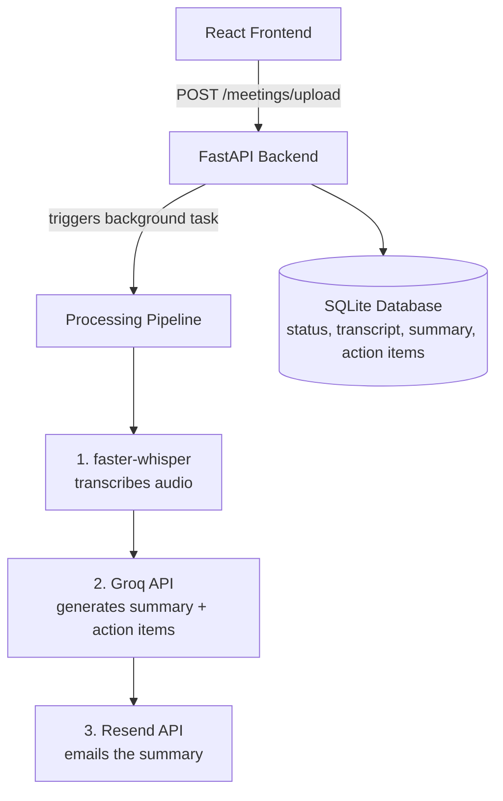

# 🧠 MeetMind

**AI-powered meeting assistant** that transcribes recordings, generates summaries and action items, and emails them automatically — no manual note-taking required.

🔗 **Live Demo:** [meetmind-frontend-e5lm.onrender.com](https://meetmind-frontend-e5lm.onrender.com)

---

## ✨ Features

- 🎙️ **Upload any recording** — audio or video (mp3, wav, mp4, etc.)
- 📝 **Automatic transcription** powered by [faster-whisper](https://github.com/SYSTRAN/faster-whisper), running locally at zero API cost
- 🤖 **AI summarization** via [Groq](https://groq.com) — concise summary + extracted action items
- 📧 **Automated email delivery** through [Resend](https://resend.com)
- ⚡ **Live status tracking** — watch progress from `uploaded → processing → done` in real time
- 🎨 **Custom dark UI** built with React + Vite

---

## 🏗️ Architecture

(status, transcript,
summary, action items)
